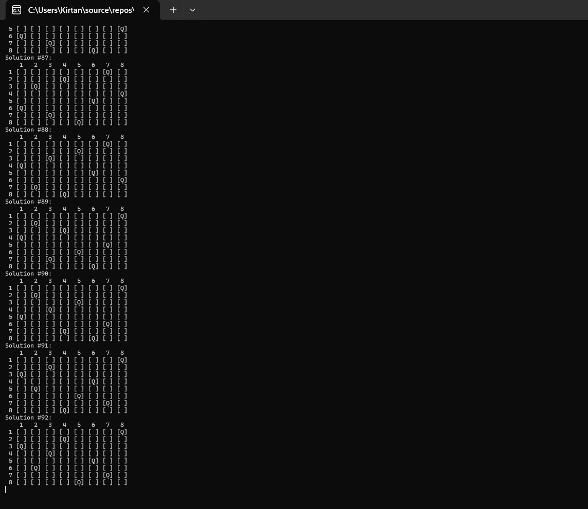

N-Queens Solver
===============

This is a console-based C# program that solves the N-Queens problem using backtracking. The N-Queens problem involves placing N queens on an N×N chessboard so that no two queens threaten each other. This means that no two queens may share the same row, column, or diagonal.

Features
--------

*   The program allows users to input the board size (minimum size of 4).
    
*   Utilizes backtracking to find all possible solutions to the N-Queens problem.
    
*   Outputs all solutions found with a visual representation of the board.
    

Getting Started
---------------

### Prerequisites

*   [.NET SDK](https://dotnet.microsoft.com/download) installed on your system.
    


## Running the Program

1. Clone or download this repository.
2. Open a terminal or command prompt and navigate to the folder containing the `Program.cs` file.
3. Compile and run the program using the following command:

   ```bash
   dotnet run
    ```
4.  Enter the desired board size when prompted (minimum size: 4).
    

## Example Usage


```bash
8 Queen solver
Enter board size (>4): 4

Solution #1:
   1   2   3   4
 1 [ ] [Q] [ ] [ ]
 2 [ ] [ ] [ ] [Q]
 3 [Q] [ ] [ ] [ ]
 4 [ ] [ ] [Q] [ ]

Solution #2:
   1   2   3   4
 1 [ ] [ ] [Q] [ ]
 2 [Q] [ ] [ ] [ ]
 3 [ ] [ ] [ ] [Q]
 4 [ ] [Q] [ ] [ ]
```
##Code Overview
-------------

### Main Components

*   **Main Method**: Entry point that prompts user input for board size and initiates the solution-finding process.
    
*   **isSafe Method**: Checks if placing a queen at a given position is valid based on current board state.
    
*   **PlaceQueen Method**: Uses backtracking to recursively place queens on the board.
    
*   **DrawChessBoard Method**: Displays the board with queens in their current positions.
    

### Key Features

*   **User Input Handling**: Prompts user to enter a board size (minimum size enforced is 4).
    
*   **Backtracking Algorithm**: Efficiently finds all valid queen placements using recursion.
    
*   **Visual Output**: Displays each solution as a formatted chessboard.
    

Future Improvements
-------------------

*   **Input Validation**: Handle invalid inputs more gracefully.
    
*   **Optimized isSafe Function**: Improve the performance of queen safety checks.
    
*   **Enhanced Visualization**: Offer more detailed board display options, e.g., with colors or different output formats.
    
*   **Command-Line Options**: Allow users to pass board size as a command-line argument.

### Output examples




License
-------

This project is licensed under the MIT License. Feel free to use and modify it for your needs.

---
### License
This project is licensed under the MIT License. See the [`LICENSE`](LICENSE) file for more details.

### Contact
Developed by Kirtan Shrestha   
[work.kirtanshrestha@gmail.com](mailto:work.kirtanshrestha@gmail.com)
